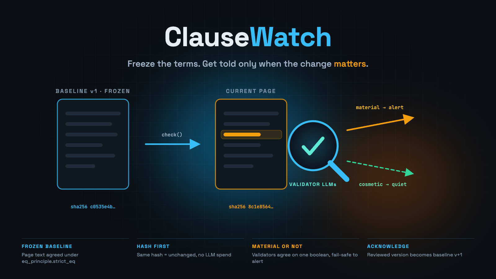

# ClauseWatchCore

<p align="center">
  
</p>

<p align="center">
  <strong>The ClauseWatch intelligent contract on its own: no frontend, no wallet code — just the primitive, its tests and a deployment you can verify.</strong>
</p>

<p align="center">
  <a href="https://github.com/valentinzubok/ClauseWatchCore/actions/workflows/ci.yml"></a>
  
  <a href="LICENSE"></a>
</p>

---

## What the primitive does

Watching a web page for meaningful change is two different problems, and every naive monitor confuses them:

- hashing the page alerts on every timestamp, counter and cache-buster;
- asking one LLM every time is unreproducible and burns tokens on pages that did not change at all.

ClauseWatch separates them, and puts each half under the consensus mechanism that fits it:

```
register_watch(watch_id, url, label, criteria)
    validators fetch the page and agree on its SHA-256 and normalized text
    (eq_principle.strict_eq) → baseline v1, stored on chain

check(watch_id)
    validators fetch it again under strict_eq
      ├─ same hash    → "unchanged": deterministic, no LLM, no alert
      └─ hash differs → validators' LLMs read BASELINE vs CURRENT against the watch
                        criteria and agree on ONE boolean via prompt_comparative
                        material = true  → alert (price, SLA, liability, data scope…)
                        material = false → cosmetic churn, recorded but quiet

acknowledge(watch_id)
    the watch creator promotes the checked version to baseline v(n+1),
    so the next check compares against what a human actually reviewed
```

<p align="center">
  
</p>

### Design decisions worth reviewing

| Decision | Why |
|---|---|
| Only `material` goes through `prompt_comparative` | Summaries, grades and categories never converge across models; a single boolean does. Grades and prose are derived locally from it. |
| Hash equality short-circuits before any LLM call | The common case (page unchanged) is deterministic and cheap. |
| A non-boolean model answer becomes `material = true` | Fail-safe: a false alert costs a glance, a missed clause costs money. |
| Baseline is versioned and only moves on `acknowledge` | Checks always compare against a reviewed version, so one change cannot silently mask the next. |
| Page text is bounded (6000 chars) and normalized | Keeps state and prompts bounded, and makes hashes stable across whitespace noise. |
| Alerts keep both hashes and the baseline version | Every verdict stays auditable after the page moves on. |

## API

| Function | Access | Effect |
|---|---|---|
| `register_watch(watch_id, url, label, criteria)` | anyone | Freeze baseline v1. Empty `criteria` falls back to the contract default. |
| `check(watch_id)` | anyone | `unchanged`, or an alert with `material` true/false. |
| `acknowledge(watch_id)` | watch creator or contract owner | Pending version becomes baseline v(n+1). |
| `set_status(watch_id, "active"\|"paused")` | watch creator or contract owner | Pause/resume checking. |
| `transfer_ownership(new_owner)` | contract owner | Move ownership. |
| `get_watch` · `get_baseline_text` · `list_ids` · `get_alert` · `list_alerts` · `get_stats` · `get_owner` · `get_criteria_template` | view | Read state. |

## Live deployment (verified by CI)

| | |
|---|---|
| Network | GenLayer Studio Dev / Studio Next, chain `61997` |
| Contract | [`0x0B32c2f2aFbbf79963D9132f93912694e913bA6d`](https://explorer-studio-dev.genlayer.com/address/0x0B32c2f2aFbbf79963D9132f93912694e913bA6d) |
| Source sha256 | `37b3c7f7a18e66a9498baa74f1379bb165bd3269375573064a190f5858f02320` |
| Full record | [`STUDIO_DEV_DEPLOY.md`](STUDIO_DEV_DEPLOY.md) |

`scripts/verify_deployment.py` compares the deployed bytes against `contracts/ClauseWatch.py` and runs on every
CI build, so the repository cannot drift away from the contract a reviewer is looking at:

```bash
python3 scripts/verify_deployment.py
# local    37b3c7f7…
# on-chain 37b3c7f7…
# match
```

## Tests

```bash
python3 -m pip install -r requirements-dev.txt
python3 -m pytest -q      # 10 tests
```

The suite substitutes a fake GenVM module, so the consensus paths run directly: baseline freezing, an unchanged
check, a cosmetic change, a material change plus acknowledgement, non-boolean verdicts failing safe, access
control, alert trimming and text bounding.

## Using it from an app

This repository is contract-only on purpose. A reference console (Next.js + `genlayer-js` + MetaMask), plus a
watched demo page whose edit history is public, lives in
**[ClauseWatch](https://github.com/valentinzubok/ClauseWatch)** → https://valentinzubok.github.io/ClauseWatch/

## License

[MIT](LICENSE) © 2026 Valentyn Zubok
